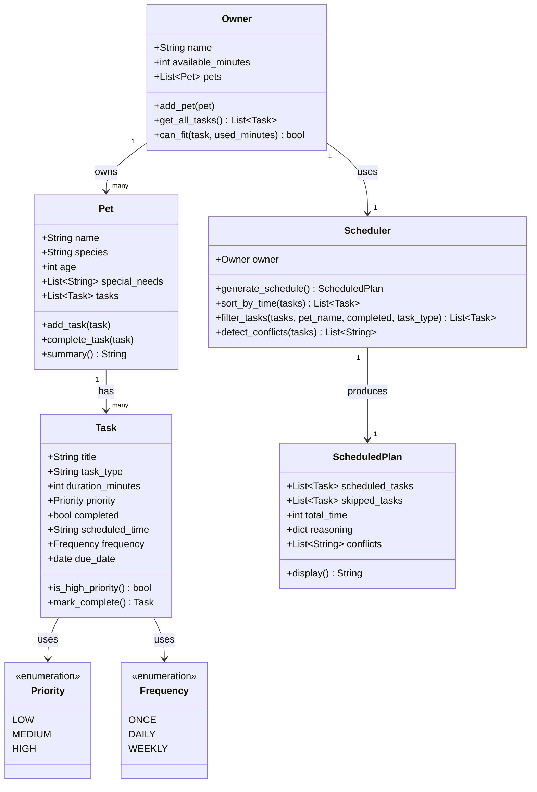

# PawPal+ Project Reflection

## 1. System Design

**a. Initial design**

The system is designed around three core user actions:

1. **Add a pet care task** — The user can create tasks (e.g., morning walk, feeding, medication) by specifying a title, estimated duration in minutes, and a priority level (low, medium, or high). Each task is stored and can be reviewed or edited before scheduling.

2. **Generate a daily schedule** — The user triggers the scheduler, which takes the full task list along with constraints (available time in the day, task priorities) and produces an ordered plan. The scheduler decides which tasks to include and in what order based on priority and time fit.

3. **View today's plan with reasoning** — The user sees the final schedule displayed clearly, with an explanation for each task — why it was included (or excluded), when it is slotted, and how long it takes. This makes the plan transparent and trustworthy rather than a black box.

**UML Class Diagram (Mermaid.js):**

**Building blocks — main objects in the system:**

**Task**
- Attributes: `title` (str), `duration_minutes` (int), `priority` (str: low/medium/high), `task_type` (str: walk/feeding/medication/grooming/etc.), `completed` (bool)
- Methods: `is_high_priority()` → returns True if priority is high; `mark_complete()` → sets completed to True

**Pet**
- Attributes: `name` (str), `species` (str), `age` (int), `special_needs` (list of str)
- Methods: `summary()` → returns a readable description of the pet

**Owner**
- Attributes: `name` (str), `available_minutes` (int — total time available in the day)
- Methods: `can_fit(task)` → checks if a task's duration fits within remaining available time

**Scheduler**
- Attributes: `tasks` (list of Task), `owner` (Owner), `pet` (Pet)
- Methods: `generate_schedule()` → sorts and filters tasks by priority and time, returns an ordered plan; `explain_plan(plan)` → produces a human-readable explanation for each included/excluded task

**ScheduledPlan**
- Attributes: `scheduled_tasks` (ordered list of Task), `skipped_tasks` (list of Task), `total_time` (int), `reasoning` (dict mapping task to explanation string)
- Methods: `display()` → formats the plan for output in the UI

**b. Design changes**

After reviewing the skeleton, three issues were identified and addressed:

1. **`priority` changed from `str` to a `Priority` enum** — The original design used plain strings ("low", "medium", "high"), which are easy to mistype and hard to validate. Switching to an `Enum` makes invalid priorities impossible and allows direct comparison in `is_high_priority()`.

2. **`Owner.can_fit()` signature changed to include `used_minutes`** — The original method only took a `task`, but had no way to know how much time was already consumed. Without `used_minutes`, the method couldn't actually check whether the task fits in the *remaining* time. Adding this parameter makes the check stateless and reusable.

3. **`Scheduler.explain_plan()` was removed** — The method was redundant: reasoning is already stored inside `ScheduledPlan.reasoning`. Having a separate method on `Scheduler` to produce the same data created ambiguity about who was responsible for building it. The responsibility was consolidated into `generate_schedule()`, which populates `ScheduledPlan.reasoning` directly.

---

## 2. Scheduling Logic and Tradeoffs

**a. Constraints and priorities**

The scheduler considers three constraints, in order of importance:

1. **Scheduled time** — Tasks with a specific `scheduled_time` (HH:MM) are placed first, in chronological order. This respects real-world commitments like medication times.
2. **Priority** — Within each time group, high-priority tasks are scheduled before medium and low. This ensures critical care (medication, feeding) happens before optional enrichment.
3. **Available time** — The owner's `available_minutes` acts as a hard cap. The scheduler greedily fills time slots and skips tasks that don't fit, recording why each was skipped.

Time and priority were ranked highest because a pet owner's day is structured around fixed events (vet appointments, medication windows) and urgent needs come first when time is limited.

**b. Tradeoffs**

**Conflict detection uses exact time matches, not overlapping durations.** Two tasks at "07:00" trigger a warning, but a 30-minute task at "07:00" and a task at "07:15" do not, even though they clearly overlap. This was a deliberate simplification — full interval-overlap detection would require tracking start and end times for every task, adding significant complexity. For a pet care app where most tasks are short and scheduled at round times (7:00, 8:00, 10:00), exact-match detection catches the most common conflicts with minimal implementation cost. A future iteration could switch to interval-based detection if finer granularity is needed.

---

## 3. AI Collaboration

**a. How you used AI**

AI (Claude Code in VS Code) was used throughout every phase:

- **Design brainstorming** — Identifying core user actions and building blocks, then generating a Mermaid.js UML diagram from the brainstormed objects.
- **Code generation** — Producing class skeletons from UML, then fleshing out full implementations with sorting, filtering, conflict detection, and recurring task logic.
- **Code review** — Asking AI to review the skeleton for missing relationships and logic bottlenecks, which caught three real issues (enum for priority, stateless can_fit, redundant explain_plan).
- **Test generation** — Drafting both happy-path and edge-case tests, then expanding coverage from 10 to 27 tests.
- **Documentation** — Generating docstrings, README sections, and reflection content.

The most helpful prompts were specific and grounded in existing code: "Based on my skeleton in pawpal_system.py, what's missing?" worked much better than vague "make it better" requests.

**b. Judgment and verification**

The initial AI-generated skeleton used a plain `str` for priority and had `Scheduler` accept a `tasks` list directly. This was rejected because:

1. Raw strings for priority are fragile — switching to a `Priority` enum prevents invalid values at the type level.
2. `Scheduler` should pull tasks from `Owner.get_all_tasks()` rather than accepting a flat list, since the owner-pet-task hierarchy is the source of truth.
3. The `explain_plan()` method was redundant with `ScheduledPlan.reasoning` — having two places that produce reasoning creates ambiguity.

Verification: after making changes, we ran the full test suite and `main.py` demo to confirm behavior matched expectations. The UML was also updated to reflect the actual final design rather than the initial draft.

---

## 4. Testing and Verification

**a. What you tested**

The test suite (27 tests) covers:

- **Task basics** — `mark_complete()` changes status, `is_high_priority()` returns correct values
- **Pet management** — adding tasks increases the list, `summary()` includes special needs when present
- **Owner logic** — `get_all_tasks()` excludes completed tasks, `can_fit()` correctly checks remaining time
- **Scheduling** — priority ordering (high before low), skipping tasks that exceed available time
- **Sorting** — time-based sort puts scheduled tasks in chronological order, unscheduled last
- **Filtering** — correctly isolates tasks by pet name or task type
- **Conflict detection** — flags two tasks at the same time, handles three-way conflicts, no false positives
- **Recurring tasks** — daily tasks create next occurrence +1 day, weekly +7 days, one-time tasks don't recur
- **Edge cases** — no pets, no tasks, zero available minutes, exact time fit, all tasks already completed, display output format

These tests are important because the scheduler makes decisions on behalf of the user (what to include, what to skip). If the priority logic or time-fitting is wrong, the owner could miss critical care tasks like medication.

**b. Confidence**

Confidence: **4 out of 5**. All happy paths and key edge cases pass. With more time, the next tests would be:

- Overlap-based conflict detection (a 30-min task at 07:00 overlapping with a task at 07:15)
- Recurring tasks chaining (completing the auto-created next occurrence should create yet another)
- Large-scale stress testing (100+ tasks to verify performance)

---

## 5. Reflection

**a. What went well**

The clean separation between the logic layer (`pawpal_system.py`) and the UI (`app.py`) worked out well. Because all scheduling logic lives in standalone Python classes, it was easy to test via `pytest` and demo via `main.py` before touching Streamlit. The reasoning system — where every scheduled and skipped task gets a human-readable explanation — makes the scheduler transparent rather than a black box.

**b. What you would improve**

1. **Overlap-based conflict detection** — Currently only exact time matches are flagged. A task at 07:00 lasting 30 minutes should conflict with a task at 07:15, but it doesn't. This would require tracking start/end intervals.
2. **Data persistence** — Right now everything resets when the Streamlit app restarts. Adding JSON save/load would make the app practical for daily use.
3. **Task editing and deletion** — Users can add tasks but can't modify or remove them through the UI.

**c. Key takeaway**

AI is effective when you treat it as a collaborator, not as an oracle. The best results came from giving it specific context (existing code, UML, concrete questions) and critically reviewing its output — catching the redundant `explain_plan()` method and the missing `used_minutes` parameter before they became real bugs. The human role is to set the architecture, catch design flaws, and make judgment calls about tradeoffs. AI accelerates the implementation, but the design decisions still need to come from someone who understands the problem.
