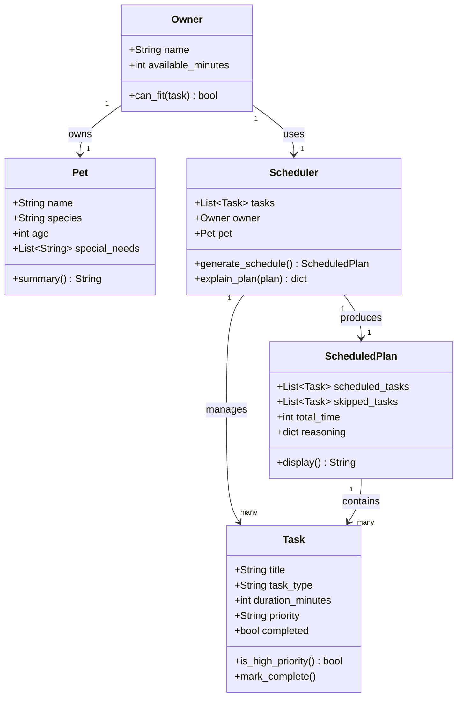

# PawPal+ Project Reflection

## 1. System Design

**a. Initial design**

The system is designed around three core user actions:

1. **Add a pet care task** — The user can create tasks (e.g., morning walk, feeding, medication) by specifying a title, estimated duration in minutes, and a priority level (low, medium, or high). Each task is stored and can be reviewed or edited before scheduling.

2. **Generate a daily schedule** — The user triggers the scheduler, which takes the full task list along with constraints (available time in the day, task priorities) and produces an ordered plan. The scheduler decides which tasks to include and in what order based on priority and time fit.

3. **View today's plan with reasoning** — The user sees the final schedule displayed clearly, with an explanation for each task — why it was included (or excluded), when it is slotted, and how long it takes. This makes the plan transparent and trustworthy rather than a black box.

**UML Class Diagram (Mermaid.js):**

**Building blocks — main objects in the system:**

**Task**
- Attributes: `title` (str), `duration_minutes` (int), `priority` (str: low/medium/high), `task_type` (str: walk/feeding/medication/grooming/etc.), `completed` (bool)
- Methods: `is_high_priority()` → returns True if priority is high; `mark_complete()` → sets completed to True

**Pet**
- Attributes: `name` (str), `species` (str), `age` (int), `special_needs` (list of str)
- Methods: `summary()` → returns a readable description of the pet

**Owner**
- Attributes: `name` (str), `available_minutes` (int — total time available in the day)
- Methods: `can_fit(task)` → checks if a task's duration fits within remaining available time

**Scheduler**
- Attributes: `tasks` (list of Task), `owner` (Owner), `pet` (Pet)
- Methods: `generate_schedule()` → sorts and filters tasks by priority and time, returns an ordered plan; `explain_plan(plan)` → produces a human-readable explanation for each included/excluded task

**ScheduledPlan**
- Attributes: `scheduled_tasks` (ordered list of Task), `skipped_tasks` (list of Task), `total_time` (int), `reasoning` (dict mapping task to explanation string)
- Methods: `display()` → formats the plan for output in the UI

**b. Design changes**

After reviewing the skeleton, three issues were identified and addressed:

1. **`priority` changed from `str` to a `Priority` enum** — The original design used plain strings ("low", "medium", "high"), which are easy to mistype and hard to validate. Switching to an `Enum` makes invalid priorities impossible and allows direct comparison in `is_high_priority()`.

2. **`Owner.can_fit()` signature changed to include `used_minutes`** — The original method only took a `task`, but had no way to know how much time was already consumed. Without `used_minutes`, the method couldn't actually check whether the task fits in the *remaining* time. Adding this parameter makes the check stateless and reusable.

3. **`Scheduler.explain_plan()` was removed** — The method was redundant: reasoning is already stored inside `ScheduledPlan.reasoning`. Having a separate method on `Scheduler` to produce the same data created ambiguity about who was responsible for building it. The responsibility was consolidated into `generate_schedule()`, which populates `ScheduledPlan.reasoning` directly.

---

## 2. Scheduling Logic and Tradeoffs

**a. Constraints and priorities**

The scheduler considers three constraints, in order of importance:

1. **Scheduled time** — Tasks with a specific `scheduled_time` (HH:MM) are placed first, in chronological order. This respects real-world commitments like medication times.
2. **Priority** — Within each time group, high-priority tasks are scheduled before medium and low. This ensures critical care (medication, feeding) happens before optional enrichment.
3. **Available time** — The owner's `available_minutes` acts as a hard cap. The scheduler greedily fills time slots and skips tasks that don't fit, recording why each was skipped.

Time and priority were ranked highest because a pet owner's day is structured around fixed events (vet appointments, medication windows) and urgent needs come first when time is limited.

**b. Tradeoffs**

**Conflict detection uses exact time matches, not overlapping durations.** Two tasks at "07:00" trigger a warning, but a 30-minute task at "07:00" and a task at "07:15" do not, even though they clearly overlap. This was a deliberate simplification — full interval-overlap detection would require tracking start and end times for every task, adding significant complexity. For a pet care app where most tasks are short and scheduled at round times (7:00, 8:00, 10:00), exact-match detection catches the most common conflicts with minimal implementation cost. A future iteration could switch to interval-based detection if finer granularity is needed.

---

## 3. AI Collaboration

**a. How you used AI**

- How did you use AI tools during this project (for example: design brainstorming, debugging, refactoring)?
- What kinds of prompts or questions were most helpful?

**b. Judgment and verification**

- Describe one moment where you did not accept an AI suggestion as-is.
- How did you evaluate or verify what the AI suggested?

---

## 4. Testing and Verification

**a. What you tested**

- What behaviors did you test?
- Why were these tests important?

**b. Confidence**

- How confident are you that your scheduler works correctly?
- What edge cases would you test next if you had more time?

---

## 5. Reflection

**a. What went well**

- What part of this project are you most satisfied with?

**b. What you would improve**

- If you had another iteration, what would you improve or redesign?

**c. Key takeaway**

- What is one important thing you learned about designing systems or working with AI on this project?
